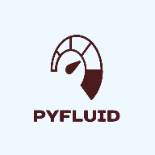

# Fluidchen Python Optimization Project

<div style="text-align: center">
  
</div>

## Project Overview

### Purpose

This project involves translating a C++ CFD solver, **fluidchen**, into Python and optimizing the Python code for performance. The solver focuses on the incompressible Navier-Stokes equations (NSE) for single-phase flow in 2D, with applications ranging from weather prediction to thermodynamics. The primary goal was to measure and improve the execution times of key functions across various case studies.

### Process

1. **Translation**: The original C++ code was translated into Python, ensuring functionality remained consistent.
2. **Measurement**: Execution times were recorded for the original Python code to establish a baseline performance.
3. **Optimization**: Several optimization techniques were applied to the Python code, including vectorization and the use of Numba for just-in-time compilation.
4. **Analysis**: The impact of each optimization was analyzed by comparing the execution times before and after optimization.
5. **Final Result**: The plot below visualizes execution times, allowing you to compare the performance of the optimized Python code against the C++ implementation.
6. **Reproducibility**: This section provides instructions and tools to reproduce the simulations and analysis.

### Goals

- Improve the performance of the Python code to match or exceed the efficiency of the original C++ program.
- Provide a comprehensive dashboard to visualize the optimization process and results, enabling easy comparison between the optimized Python code and the C++ implementation.

## Getting Started

Follow these steps to set up and run the project dashboard on your local machine.

### Step 1: Set up a Virtual Environment

Create and activate a virtual environment to manage dependencies:

```bash
# Create a virtual environment
python -m venv venv

# Activate the virtual environment
# On Windows
venv\Scripts\activate

# On macOS/Linux
source venv/bin/activate
```

### Step 2: Install Dependencies

Install the required dependencies by running:

```bash
pip install -r requirements.txt
```

### Step 3: Run the Application

Use the command line to run the script and start the Dash server:

```bash
python app.py
```

The dashboard will be accessible at http://127.0.0.1:8050/ in your web browser.

## Features

- Interactive data visualizations
- Dynamic filtering options
- Detailed project metrics
- User-friendly interface

The resulting Dashboard is the final presentation as well as the documentation of my project. It includes various interactive components and visualizations that allow users to explore the project data in depth.
```
